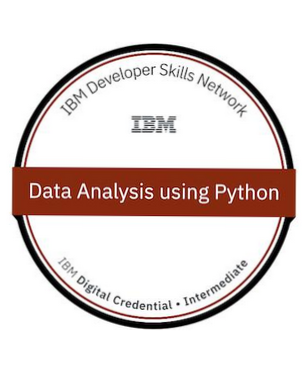
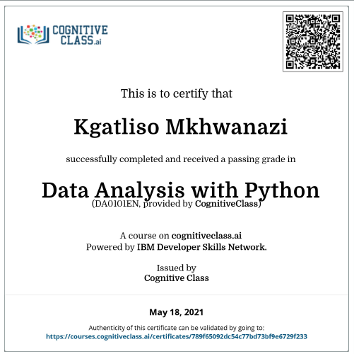

# Data Analysis with Python

___This is a repository that tracks my progress in the IBM Cognative class course namely, Data Analysis with Python.___

___I have passed the IBM cognitive class with a mark of 100% to receive my badge and certificate which you can see below.___
IBM badge                          |  IBM certificate
:---------------------------------:|:-------------------------:
   | 

___Below are the links to my GitHub Gist and IBM Watson Studio accounts which shows what I've learnt in the IBM Cognative class course.___

        
Links 

        
 Introduction Notebook : https://gist.github.com/6b34ca9f445d96610f2eb8721855c223 

        
 Data Wrangling : https://gist.github.com/3163f5481b393a3fe9569edb30bca384 

        
 Data Analysis with Python : https://gist.github.com/5e7d70b12a6c6902070fe1f0e2e5f74f 

        
 Model Development : https://gist.github.com/753ddece9dbc7a9187aca5ce7c630672 

        
 Model Evaluation and Refinement : https://gist.github.com/bf0e42fe3b96b5ae08e2411b2b41469c 

